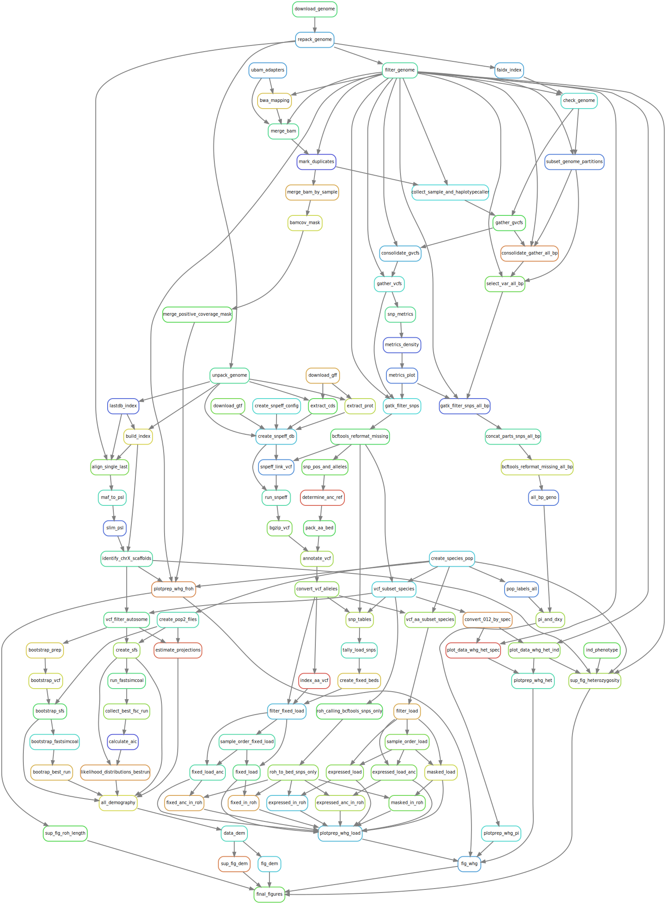

# Elephant Seal Project 

**Author:** Kosmas Hench

This repository contains the analysis of the whole genome resequencing data analysis for the study *Consequences of an extreme bottleneck for the genetic load, inbreeding depression and the population recovery of the northern elephant seal* by Hoffman *et al*.

## Overview

The analysis was managed using a [`snakemake`](https://snakemake.github.io/) (v 7.19.1) pipeline, which is located at `code/workflow/snakefile`.
To execute the pipeline, the working directory of the `bash` session running `snakemake` needs to be the `code/` directory.

### Sub-Modules

This pipeline contains several modules that can (and were) run separately.

For example to run prepare the reference genomes for the genotyping one would run the following:

```sh
cd code/
snakemake <choice of run parameters> geno_prep
```

The individual logical steps of the analysis are distributed over several `smk` files, located at `code/workflow/rules/`.

The structure of those `smk` is generally as follows:

- a small commented header that holds the launch commands used for this step of the pipeline
- one or several *target rules*, which don't produce output but gather all final files that this pipeline step is supposed to provide
- an arbitrary long list of *worker rules*, which produce files and which are listed in the order of the actual workflow as far as possible 

### Target Rules

Important *target rules* are for example:

- `geno_prep` (`genotype_prep.smk`): preparing the genomes for genotyping
- `gt_all` (`genotyping.smk`): running GATK to genotype up to the filtered `vcf` file
- `gt_invariant` (`genotyping.smk`): running GATK to genotype up to the filtered `vcf` file, but this time including invariant sites
- `all_gt_qc` (`genotyping_qc.smk`): running the quality control for the genotyping
- `all_anc_allele` (`ancestral_alleles.smk`): assign ancestry status to alleles based on a `cactus` alignment
- `all_ml_snpeff` (`mutation_load_functional.smk`): score SNPs using `SNPeff` and tally load types
- `all_diversity` (`diversity.smk`): pi, heterozygosity and SNP density summaries
- `call_roh` (`roh_calling.smk`): call runs of homozygosity (ROH) using `bcftools` and `plink`
- `all_demography` (`demographic_history.smk`): run the demographic history inference with `fastsimcoal`
- `final_figures` (`figures.smk`): create the figures used in the manuscript

### Cautionary note (Disc Usage Footprint)

At the time of submission the whole directory has a disc usage footprint of  roughly 8 Tb:

```sh
du -sh elephant_seals
8.1T	elephant_seals
```

Note that this estimate does *not include the raw data*.

### Raw data

The raw sequencing data were submitted to SRA with the accession number PRJNA1039994.
To re-run the analysis, the whole genome resequencing raw data needs to be downloaded and placed within the directory `data/raw_sequences/`:

```sh
ls -1 data/raw_sequences/
# A006850217_177968_S264_L003_R1_001.fastq.gz
# A006850217_177968_S264_L003_R2_001.fastq.gz
# <...>
# A006850217_178026_S293_L004_R2_001.fastq.gz
```


## Working Environments

Working environments and used software versions were controlled using a combination of [`conda`](https://docs.conda.io/en/latest/) environments and [`apptainer`](https://apptainer.org/) containers.

The used `conda` environments are specified in `yml` files located under `code/workflow/envs/`.

The used containers are specified within the `snakemake` config file (`code/workflow/config.yml`).

**!! Note that `config.yml` will need adjusting when trying to re-run the analysis in a different environment:**

That is because the used container are currently pointing to **local copies** of the containers on the HPC where the analysis was originally run.

Every container listed in the config file has an accompanying comment on how to re-create the local copy:

```yml
# apptainer pull docker://quay.io/comparative-genomics-toolkit/cactus:v2.5.1
cactus_sif: '$CDATA/apptainer_local/cactus_v2.5.1.sif'

# ...

# local paths to stored sif files for offline usage:
# apptainer pull docker://khench/genotyping_suite:v0.3
sif_gatk: '$CDATA/apptainer_local/genotyping_suite_v0.3.sif'
# apptainer pull docker://khench/qc_suite:v0.3
sif_qc: '$CDATA/apptainer_local/qc_suite_v0.3.sif'
# apptainer pull docker://khench/popgen_suite:v0.2
sif_popgen: '$CDATA/apptainer_local/popgen_suite_v0.2.sif'
# apptainer pull docker://khench/popsim_suite:v0.2
sif_sim: '$CDATA/apptainer_local/popsim_suite_v0.2.sif'
# apptainer pull docker://khench/re_load:v0.2
sif_ml: '$CDATA/apptainer_local/re_load_v0.2.sif'
# apptainer pull docker://lindenb/jvarkit:1b2aedf24
sif_jvar: '$CDATA/apptainer_local/jvarkit_1b2aedf24.sif'
```

The local paths within the config file will need to be adjusted to your setup 
(particularly, the `$CDATA/apptainer_local/` part of it).

## External Input

Some aspects of the pipeline require input that was provided by colleagues.
This concerns particularly those parts where the whole genome resequencing data is compared to RAD based analysis (eg. the demographic history part).

How to generate these data is documented within their own [github repository](https://github.com/DavidVendrami/NorthernElephantSeals).

## Full Pipeline Overview

In theory the whole analysis can be re-run from raw data to final figures with using the `snakemake` rule `final_figures` (this is *not* recommended - take it slow...):

```sh
cd code/
snakemake <choice of run parameters> final_figures
```

This will resolve the following steps:



---